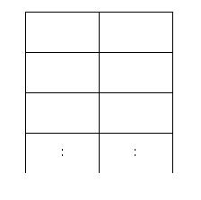

# Baekjoon

## [1309번](https://www.acmicpc.net/problem/1309) 

### 문제

어떤 동물원에 가로로 두칸 세로로 N칸인 아래와 같은 우리가 있다.



이 동물원에는 사자들이 살고 있는데 사자들을 우리에 가둘 때, 가로로도 세로로도 붙어 있게 배치할 수는 없다. 이 동물원 조련사는 사자들의 배치 문제 때문에 골머리를 앓고 있다.

동물원 조련사의 머리가 아프지 않도록 우리가 2*N 배열에 사자를 배치하는 경우의 수가 몇 가지인지를 알아내는 프로그램을 작성해 주도록 하자. 사자를 한 마리도 배치하지 않는 경우도 하나의 경우의 수로 친다고 가정한다.

### 입력

첫째 줄에 집의 수 N(2 ≤ N ≤ 1,000)이 주어진다. 둘째 줄부터 N개의 줄에는 각 집을 빨강, 초록, 파랑으로 칠하는 비용이 1번 집부터 한 줄에 하나씩 주어진다. 집을 칠하는 비용은 1,000보다 작거나 같은 자연수이다.

### 출력

첫째 줄에 모든 집을 칠하는 비용의 최솟값을 출력한다.

### 문제 풀면서 배운 점

이게 왜 다이나믹 프로그래밍 문제인가 생각이 들었지만 문제풀이를 혼자 풀이하기보다 정답을 보고나서 다이나믹 프로그래밍이 맞구나라고 생각이 바뀌었다.

### 소스코드

#### 정종원
```python
# 1
# 3

# 2
# 7

# 3
# 17

# 4
# 41

# dp[n] = (dp[n-1] * 2) + dp[n-2]

n = int(input());

dp = [0,3,7];
for i in range(3,n+1):
    dp.append(i);

    dp[i] = ((dp[i-1] * 2) + dp[i-2] ) % 9901;

print(dp[n]); 
```
### 김형준
```java

```
### 김현선
```java

```